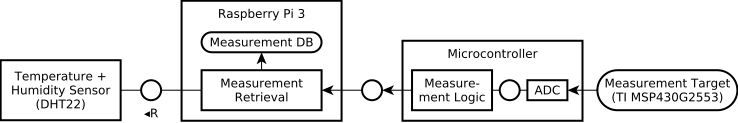

**WARNING:** *THIS SOFTWARE IS PROVIDED BY THE COPYRIGHT HOLDERS AND CONTRIBUTORS "AS IS" AND ANY EXPRESS OR IMPLIED WARRANTIES, INCLUDING, BUT NOT LIMITED TO, THE IMPLIED WARRANTIES OF MERCHANTABILITY AND FITNESS FOR A PARTICULAR PURPOSE ARE DISCLAIMED. IN NO EVENT SHALL THE COPYRIGHT HOLDER OR CONTRIBUTORS BE LIABLE FOR ANY DIRECT, INDIRECT, INCIDENTAL, SPECIAL, EXEMPLARY, OR CONSEQUENTIAL DAMAGES (INCLUDING, BUT NOT LIMITED TO, PROCUREMENT OF SUBSTITUTE GOODS OR SERVICES; LOSS OF USE, DATA, OR PROFITS; OR BUSINESS INTERRUPTION) HOWEVER CAUSED AND ON ANY THEORY OF LIABILITY, WHETHER IN CONTRACT, STRICT LIABILITY, OR TORT (INCLUDING NEGLIGENCE OR OTHERWISE) ARISING IN ANY WAY OUT OF THE USE OF THIS SOFTWARE, EVEN IF ADVISED OF THE POSSIBILITY OF SUCH DAMAGE.*

For further details, see the [LICENSE file](LICENSE.md).

# Paper: Towards Practical Hardware Fingerprinting for Remote Attestation

Our paper "[Towards Practical Hardware Fingerprinting for Remote Attestation](https://ifipsec2024.co.uk/program/)" by [Michael Eckel](mailto:michael.eckel@sit.fraunhofer.de), [Florian Fenzl](mailto:florian.fenzl@sit.fraunhofer.de), and [Lukas Jäger](mailto:lukas.jaeger@sit.fraunhofer.de) (all [Fraunhofer SIT](https://www.sit.fraunhofer.de/) and [ATHENE Center](https://www.athene-center.de/)) was first published at the 39th International Conference on ICT Systems Security and Privacy Protection ([IFIP SEC 2024](https://ifipsec2024.co.uk/)), organized by Edinburgh Napier University in Edinburgh, United Kingdom.

This repository contains the code and data referred to in the paper: codebase, data sets, anlysis tools, and the analog hardware measurements log format.

## Long-Term Analog Measurements PoC Setup


In our research, we devised two distinct test setups to conduct long-term hardware fingerprinting measurements, focusing on environmental parameters’ influence on hardware behavior. Aur measurement setup is as follows.



It involves a Raspberry Pi 3 connected to a DHT22 temperature and humidity sensor via General Purpose Input/Output (GPIO) pins.
Simultaneously, a MCU is connected to the Raspberry Pi via USB to collect ADC measurements from a target device, a TI MSP430G2553.
For the setup, we use a the MCU NUCLEO-L432KC featuring a STM32.

The MCU code can be found in the [GenericAttCDDL](GenericAttCDDL/) folder. A current version of STM32CubeIDE is required to run the Code.
After importing the project folder, the Project provides the two targets `GenericAttCDDL Release` and `GenericAttCDDL Debug` for compiling, debugging and running the code on a connected microcontroller.

## Long-Term Analog Measurements Analysis

We provide a jupyter notebook containing the different steps for the data analysis.

In general, the notebook will first perform some basic analysis on the data of a specific selected sample series for a given type of measurement and compare these values with temperature and humidity values provided in the database.
This comparison is primarily done by calculating some correlation coefficients (*Spearman*, *Pearson* and *Kendall*), as well as creating visualiations of value curves of interesting data intervals (Section *Evaluation of specific interval*).

The notebook will also perform a analysis of the changes in between the first and last samples of measurements in comparison to temperature and humidity (Section *Evaluation of Value Changes between samples*)

In addition, to that the notebook will create some overviews and comparisons of all measurement types and intervals (Section *Create overview Plots*).

And finally, the notebook will create raw overview images to compare the first and last samples for a specific measurement group in between both database files (Secion *Compare both recorded databases*)

### Python Requirements

- `jupyterlab`
- `pandas`
- `seaborn`
- `matplotlib`

### Usage

Run Jupyter Lab:

```bash
$ jupyter lab
```

Select the `analysis.ipynb` notebook and press *Restart Kernel and run all cells*.

The first cell contains come configuration parameter that can be adjusted to analyse different
recording series and samples.

We assume that in the same folder as the notebook, the datase files `records_00.db` and `records_01.db` are present.
If this is not the case please set the correct path in the variables `DATABASE_00` and `DATABASE_01` in the first cell.

By default, the notebook will show the evaluation results for the file `records_01.db`.
The selected database can be changed by modifying following command and changind `DATABASE_01` to `DATABASE_00`.

```python
sql_connection = sqlite3.connect(f'{DATABASE_01}.db')
```

There are three types of measured values present in the recorded data, *Capacitive Load* (0), *Digital Load* (1) and *Resistive Load* (2).
By default, the notebook will show the evaluation results for *Capacitive Load*.
This can be adjusted by changing the value of the following command with the correct number of the type of measurement:

```python
GROUP = GROUPS[0]
```

There are a total of 30 samples taken per measurement.
By default, for the first sections of the notebook only a single column of sample is observed.
This is by default the last sample of a series `sample_29` (a measurement starts with `sample_00`)
The sample to be inspected can be adjusted through modifying the following line:

```python
SAMPLE = 'sample_29'
```

In this first configuration cell some other heuristic parameters and flags can be adjusted.
For additional information see comments with the notebook.

## Analog Log Format

The analog log format can be found here here: [`analog-log-format.cddl`](analog-measurement-log-format/analog-log-format.cddl).
It uses the [Concise Data Definition Language (CDDL) (RFC 8610)](https://datatracker.ietf.org/doc/html/rfc8610) notational convention (specification) to describe the [Concise Binary Object Representation (CBOR) (RFC 8949)](https://datatracker.ietf.org/doc/html/rfc8949) data structures (for wire-encoding) for our proof-of-concept implementation.

The following CDDL tools can be installed to verify the log format's CDDL and generate sample instances: [cddl](https://rubygems.org/gems/cddl) (CDDL tool) and [cddlc](https://rubygems.org/gems/cddlc) (CDDL conversion utilities).
In Ubuntu (and Debian based distributions) you can do so with (using Bash):

```bash
sudo apt update && sudo apt install ruby

## or
sudo snap install ruby
```

Then:

```bash
sudo gem install cddl cddlc
```

You can do the following with the tools:

```bash
## print CDDL format specification in YAML format
/usr/local/bin/cddlc -ty analog-measurement-log-format/analog-log-format.cddl

## print CDDL format specification in JSON format
/usr/local/bin/cddlc -tj analog-measurement-log-format/analog-log-format.cddl

## generate sample instance
/usr/local/bin/cddl analog-measurement-log-format/analog-log-format.cddl generate

## genrate sample instance in JSON format
/usr/local/bin/cddl analog-measurement-log-format/analog-log-format.cddl json-generate
```

For further information, see the help messages:

```bash
/usr/local/bin/cddl -h
/usr/local/bin/cddlc -h
```
